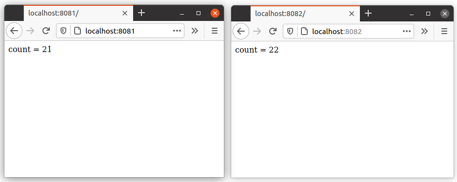

# cloud_web

# 1 лабораторная работа. Реализация балансировки и отказоустойчивости с использованием Nginx + Реализация запуска приложения с использованием Docker

Для реализации данной работы было разработано приложение на Java с использованием Spring Boot. Приложение называется demo и находится в одноименной папке. Данное приложение при обращении к нему возвращает ответ типа count = 1 (количество обращений к приложению).

Далее был создан Dockerfile, который содержит параметры для упаковки приложения в котейнер. Для запуска приложения из контейнера в терминале необходимо ввести команду "sudo docker run -p 8080:8080 c13518c0c795",находясь в директиве с файлом.

Для запуска нескольких приложений был создан файл "docker-compose.yml", в котором находится описание трех контейнеров с приложением demo. Чтоб запустить этот файл необходимо,находясь в директиве с файлом, в командной строке написать "sudo docker-compose up".

В папке Nginx находится конфигурационный файл "Nginx_Round_Robin.conf" в котором находится конфигурация для балансировщика нагрузки и Dockerfile для запуска nginx из контейнера.

# 2 лабоработная работа. Реализация разделяемого хранилища с использованием Redis

В ходе данной работы был установлен Redis на Ubuntu. После чего подключаем клиент jedis для работы из веб-приложения из 1 лабораторной работы. 

Jedis jedis = new Jedis("localhost", 6379);

Далее идет проверка есть ли ключ "count" в БД, если нет, то создаем запись "jedis.set("count", "0");", если есть, то запрашиваем счетчик, инкрементируем его "Long c = jedis.incr("count");" и выводим его на форму Long c = jedis.incr("count");

Для проверки запускаем два приложения на портах 8081 и 8082, обновляем страницы на обоих приложениях счетчик увеличивается:

