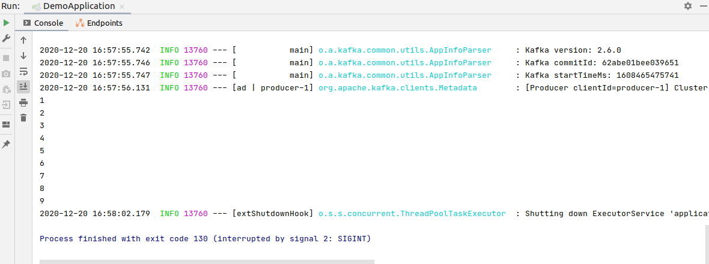
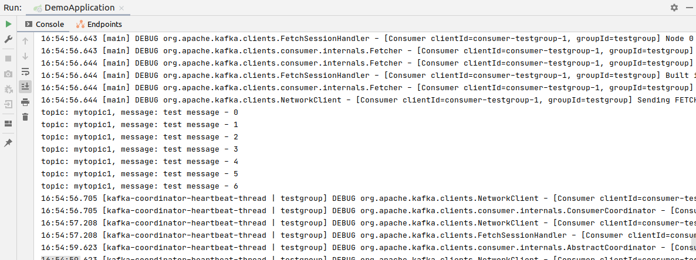
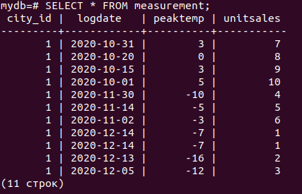
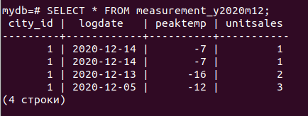
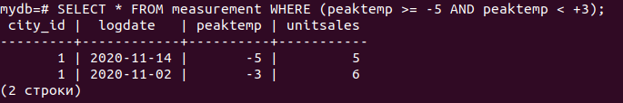
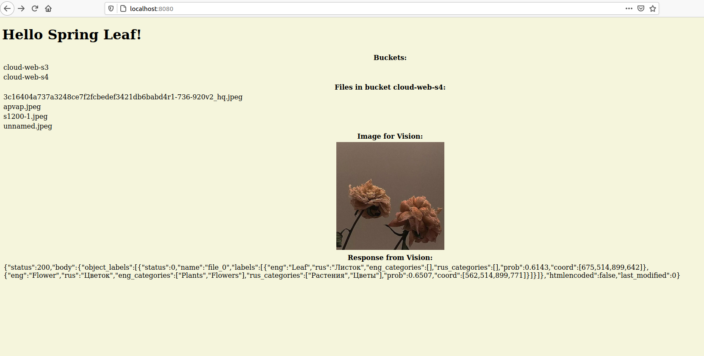

# cloud_web

# 1 лабораторная работа. Реализация балансировки и отказоустойчивости с использованием Nginx + Реализация запуска приложения с использованием Docker

Для реализации данной работы было разработано приложение на Java с использованием Spring Boot. Приложение называется demo и находится в одноименной папке. Данное приложение при обращении к нему возвращает ответ типа count = 1 (количество обращений к приложению).

Далее был создан Dockerfile, который содержит параметры для упаковки приложения в котейнер. Для запуска приложения из контейнера в терминале необходимо ввести команду "sudo docker run -p 8080:8080 c13518c0c795",находясь в директиве с файлом.

Для запуска нескольких приложений был создан файл "docker-compose.yml", в котором находится описание трех контейнеров с приложением demo. Чтоб запустить этот файл необходимо,находясь в директиве с файлом, в командной строке написать "sudo docker-compose up".

В папке Nginx находится конфигурационный файл "Nginx_Round_Robin.conf" в котором находится конфигурация для балансировщика нагрузки и Dockerfile для запуска nginx из контейнера.

# 2 лабоработная работа. Реализация разделяемого хранилища с использованием Redis

В ходе данной работы был установлен Redis на Ubuntu. После чего подключаем клиент jedis для работы из веб-приложения из 1 лабораторной работы. 

Jedis jedis = new Jedis("localhost", 6379);

Далее идет проверка есть ли ключ "count" в БД, если нет, то создаем запись "jedis.set("count", "0");", если есть, то запрашиваем счетчик, инкрементируем его "Long c = jedis.incr("count");" и выводим его на форму Long c = jedis.incr("count");

Для проверки запускаем два приложения на портах 8081 и 8082, обновляем страницы на обоих приложениях счетчик увеличивается:

# 3 лабораторная работа. Реализация балансировки нагрузки с использованием очередей Kafka

Для реализации данной работы был использован Docker-compose файл c Kafka. Так же было создано два приложения:
- demo - Producer - с неравномернй скоростью посылает сообщения в очередь;
- demo1 - Consumer - читает из очереди сообщения с определенными промежутками времени.

Необходимо было запустить докер-файл с Кафкой, затем demo и demo1. На рисунках ниже представлен вывод в консоль во время работы данных приложений.

Producer:

Consumer:

# 4 лабораторная работа. Реализация партиционирования с использованием Postgres

В ходе данной работы была установлена СУБД Postgres и создана БД mydb.

Далее была создана таблица measurement:

CREATE TABLE measurement (
    city_id         int not null,
    logdate         date not null,
    peaktemp        int,
    unitsales       int
) PARTITION BY RANGE (logdate);

После чего были созданы партиции по месяцам: октябрь, ноябрь и декабрь:

CREATE TABLE measurement_y2020m10 PARTITION OF measurement
    FOR VALUES FROM ('2020-10-01') TO ('2020-11-01');

CREATE TABLE measurement_y2020m11 PARTITION OF measurement
    FOR VALUES FROM ('2020-11-01') TO ('2020-12-01');

CREATE TABLE measurement_y2020m12 PARTITION OF measurement
    FOR VALUES FROM ('2020-12-01') TO ('2021-01-01');

Таблица были заполнены данными, по запросы у на выборку пришел следующий ответ:

Если сделать запрос на выборку данных только из партиции за декабрь получим следующий результат: 

Запрос на выборку данных с температурой от +3 до -5:

SELECT * FROM measurement WHERE (peaktemp >= -5 AND peaktemp < +3);

# 5 лабораторная работа. S3 + Vision
Для реализации данной лабораторной работы использовался облачный провайдер Mail Cloud Solutions. 

В данной работе реализованы запросы к бакетам на их добавление и удаление, а так же запросы на загрузку файлов в эти бакеты, на удаление и просмотр. Функции реализованы только в коде, из веб-интерфейса к ним невозможно обратиться. На веб-странице приложения выведен список всех бакетов и список всех файлов из бакета "cloud-web-s4". Реализация данных функций представлена в файле S3.java.

Работа с функцией компьютерного зрения Vision осуществляется аналогичным образом. В файле Vision.java находится реализация функций. На веб-интерфейсе приложения загружается картинка, которая была отправлена для анализа. Ниже картинки выводится пришедший ответ с данными о том, что изображено на картинке.  Запрос к Vision осуществляется через вызов файла-скрипта req.sh с curl-запросом к командной строке. 

# 6 лабораторная работа. Kubernetes
Для реализации данной лабораторной работы на ОС Windows были установлены следующие программы: Docker Desktop, minikube для локального запуска кластера и kubestl. 

Для старта minicube используется команда "minicube start".

На рисунке представлен веб-интерфейс kubernetes, доступнуй по команде "minicube dashboard"

Так же в кластере были загружены поды nginx с помощью yml-файла, представленного в папке Kubernetes.
